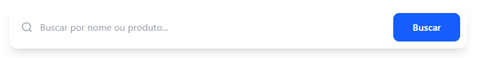
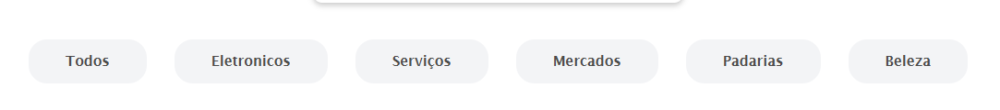
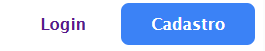

# Template padrão do site
O layout padrão do site foi definido com o objetivo de manter uma estrutura organizada e consistente em todas as páginas do sistema.
A base do layout segue a divisão , separando o site em três áreas:
Header (cabeçalho)
Main (conteúdo principal)
Footer (rodapé)
Essa estrutura será reutilizada em todas as páginas, garantindo que o usuário sempre encontre os elementos nos mesmos lugares.
- Guias de estilo do projeto
  
1-Foi definidas algumas guias de estilo com o objetivo de manter um padrão visual em todas as páginas.As cores neutras, como branco, cinza e preto, foram utilizadas como base do layout.
  
2-A tipografia utilizando fonte sem serifa. Foi definida uma hierarquia entre os textos:
Títulos com maior destaque e peso mais forte
Subtítulos com destaque intermediário
Textos comuns com peso normal

3-O header mantém sempre o mesmo padrão em todas as páginas, com logo, menu e botões de acesso. Ele foi projetado para ser simples e direto ,o footer também segue um padrão fixo, com fundo escuro e informações organizadas em colunas. Ele serve como área complementar, reunindo links e dados do site.
  
4-Interatividade
Foi aplicados pequenos efeitos visuais para melhorar a interação do usuário, como:
Mudança de cor ao passar o mouse
Efeito de destaque em botões
Animação leve nos cards

## Design
O logo do sistema, com o nome CATALOG, fica no canto esquerdo do cabeçalho.

Menu de navegação
O menu principal fica no cabeçalho, mais ao centro da página. Ele contém as opções:
Início
Categorias
Favoritos
Seus Negócios
Também foi adicionado um efeito ao passar o mouse nos links, para deixar claro que são clicáveis.

Área de acesso do usuário
No lado direito do cabeçalho ficam os botões de Login e Cadastro.

Conteúdo principal
Entre as principais seções estão:

Uma área de busca, onde o usuário pode pesquisar por serviços ou produtos
Botões de categorias, para filtrar os tipos de negócios
Cards de promoções, mostrando ofertas em destaque
Um destaque da semana, com algum negócio ou serviço em evidência

Rodapé (footer)
Ele é dividido em partes, contendo:

Nome do site e uma breve descrição
Links de navegação
Área voltada para empresas
Informações gerais

## Cores
Paleta de Cores ultilizada
Primária	#3B82F6	Botões, links
Primária hover	#2274f7	Interação
Fundo principal	#ffffff	Layout
Fundo secundário	#fafbfc	Cards
Texto principal	#585858	Leitura
Texto secundário	#4d4c4c	Apoio
Footer	#111827	Rodapé
Cinza claro	#F3F4F6	Categorias

## Tipografia

A fonte principal utilizada será Lucida Sans.
Logo da página
Utiliza uma variação mais forte da fonte (negrito), com tamanho maior, com o objetivo de destacar a identidade do site logo no topo da página.
Títulos de Seção (“Promoções em Destaque”, “Destaque da Semana”)
São apresentados com peso semi-negrito, servem para organizar o conteúdo em blocos.

Rótulos de Componentes (menus, botões e categorias)
Utilizam um peso intermediário da fonte, garantindo boa leitura e clareza nas ações disponíveis.

## Iconografia
Ícones utilizados
Ícone de busca (lupa)
Utilizado na barra de pesquisa. Sua função é indicar ao usuário o campo onde ele pode realizar buscas por produtos, serviços ou estabelecimentos.
CSS:
.text_pesquisa {
    position: relative;
    display: flex;
    justify-content: center;
    align-items: center;
}

.input_search {
    width: 30%;
    height: 4.5rem;
    border-radius: 10px;
    box-shadow: 0 3px 6px rgba(0,0,0,0.2);
    padding-left: 50px;
}

 Dois estilos de botões
Os botões foram estilizados com aparência leve e interativa.
CSS:
.botoes_categoria {
    background-color: #F3F4F6;
    border-radius: 20px;
    padding: 15px 40px;
    border: none;
    cursor: pointer;
}
.botoes_categoria:focus {
    background-color: #3B82F6;
    color: #fff;
}
.cadastro{
    background-color: #3B82F6;
    border-radius: 8px;
    padding-bottom: 12px;
    padding-top: 12px;
    color: #fff;
}
.cadastro:hover{
    background-color: #2274f7 ;
}

> **Links Úteis**:
>
> -  [Como criar um guia de estilo de design da Web](https://edrodrigues.com.br/blog/como-criar-um-guia-de-estilo-de-design-da-web/#)
> - [CSS Website Layout (W3Schools)](https://www.w3schools.com/css/css_website_layout.asp)
> - [Website Page Layouts](http://www.cellbiol.com/bioinformatics_web_development/chapter-3-your-first-web-page-learning-html-and-css/website-page-layouts/)
> - [Perfect Liquid Layout](https://matthewjamestaylor.com/perfect-liquid-layouts)
> - [How and Why Icons Improve Your Web Design](https://usabilla.com/blog/how-and-why-icons-improve-you-web-design/)
